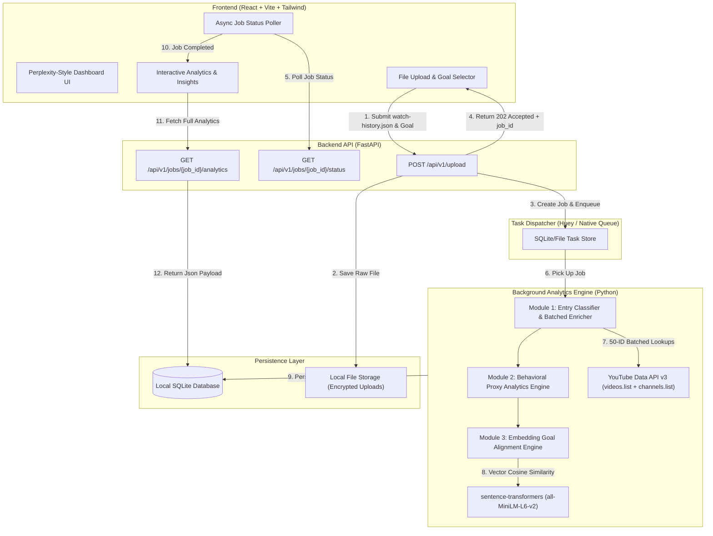
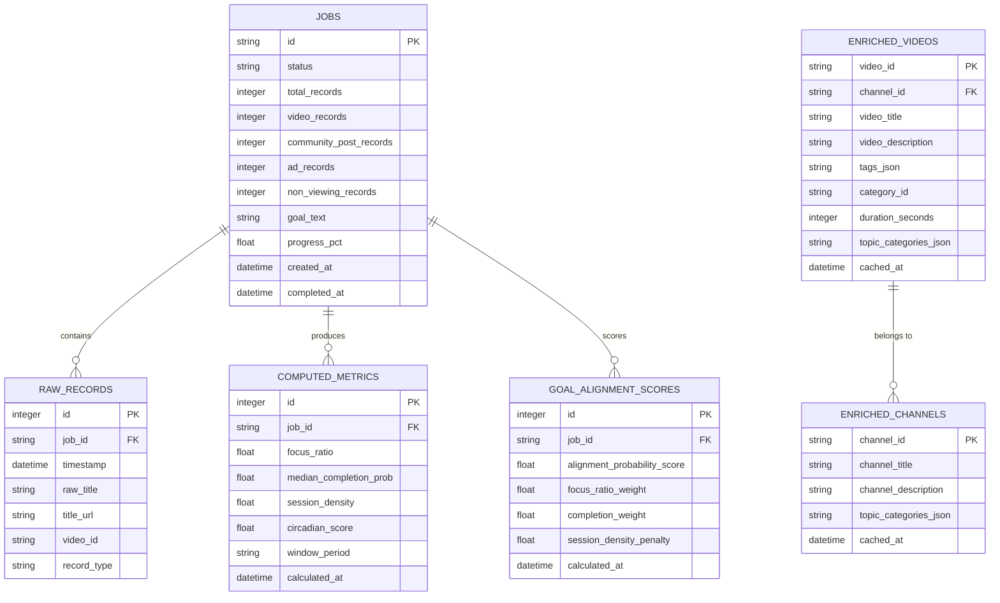
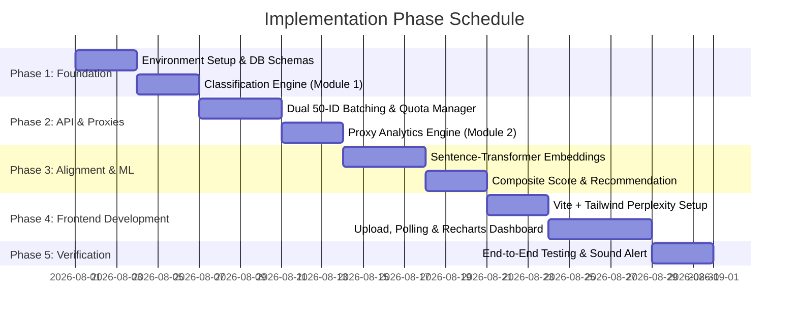

# Detailed Implementation Plan: AI-Driven YouTube Behavioral Analytics & Goal Alignment Predictor

**Version:** 1.0  
**Target Stack:** Option 1 — Decoupled React (Vite) + Tailwind CSS + FastAPI (Python 3.10+)  
**Deployment Mode:** Non-Containerized (Native OS Execution via Python `venv` and Node.js `npm`)  
**Design Aesthetic:** High-End Minimalist 'Perplexity' Aesthetic (`rounded-[32px]` containers, font-black headings, generous whitespace, dark/light ambient contrast, subtle micro-animations)

---

## 1. Executive Summary & Architecture Overview

This document presents the comprehensive, step-by-step engineering implementation plan for the **YouTube Behavioral Analytics & Goal Alignment Predictor**. The system ingests a user's Google Takeout `watch-history.json`, filters non-video records, asynchronously enriches video metadata via the YouTube Data API v3 using dual-endpoint 50-ID batching, computes mathematical behavioral proxy metrics, and derives a goal alignment score via unsupervised vector embeddings (`sentence-transformers`).



---

## 2. Technology Stack Specification (Non-Containerized)

> [!IMPORTANT]
> No Docker or container tools will be used. The backend, background worker, database, and frontend dev server run directly on the host machine using native Python virtual environments and Node.js environments.

### 2.1 Backend Stack (Python 3.10+)
* **Framework:** `FastAPI` (v0.111.0+) — Async ASGI Web Server driven by `uvicorn`.
* **Task Queue & Processing:** `Huey` (v2.5.0+) or `FastAPI BackgroundTasks` + SQLite task storage (lightweight, zero-Docker dependency, robust for local async processing).
* **Data Manipulation & Parsing:** `pandas` (v2.2.0+), `numpy` (v1.26.0+), `pydantic` (v2.7.0+).
* **API Integration:** `google-api-python-client` (v2.120.0+) for YouTube Data API v3 integration.
* **Vector Embeddings & NLP:** `sentence-transformers` (v3.0.0+) using model `all-MiniLM-L6-v2` (fast CPU execution, 384-dimensional embeddings), `scikit-learn` (v1.5.0+) for cosine similarity calculations.
* **Database & Persistence:** `SQLAlchemy` (v2.0.0+) ORM with `SQLite` (native file database, no installation required).

### 2.2 Frontend Stack (Node.js 18+)
* **Framework / Build Tool:** `React 18` + `Vite 5` (TypeScript).
* **Styling & Design System:** `Tailwind CSS v3.4` + `@tailwindcss/typography`.
* **UI Components & Icons:** `Lucide-React` icons, `@radix-ui/react-dialog`, `@radix-ui/react-tooltip`.
* **Charts & Data Visualization:** `Recharts` (v2.12.0+) tailored with custom clean SVG gradients and responsive wrappers.
* **Animations:** `Framer Motion` (v11.0.0+) for subtle micro-interactions and smooth page transitions.
* **HTTP Client & State:** `Axios` / `TanStack React Query v5`.

---

## 3. Project Directory Structure

```text
DAProject/
├── backend/
│   ├── app/
│   │   ├── __init__.py
│   │   ├── main.py                   # FastAPI application entrypoint
│   │   ├── config.py                 # Application settings & environment variables
│   │   ├── db/
│   │   │   ├── session.py            # SQLite database engine connection
│   │   │   └── models.py             # SQLAlchemy DB schemas
│   │   ├── api/
│   │   │   ├── __init__.py
│   │   │   ├── router.py             # API route aggregator
│   │   │   └── v1/
│   │   │       ├── upload.py         # File ingestion endpoint
│   │   │       ├── jobs.py           # Job status & polling endpoints
│   │   │       └── analytics.py      # Analytics results endpoints
│   │   ├── services/
│   │   │   ├── __init__.py
│   │   │   ├── classifier.py         # Entry-type classification (Video, Post, Ad)
│   │   │   ├── youtube_api.py        # Batched API enrichment (videos.list + channels.list)
│   │   │   ├── quota_manager.py      # 10,000-unit API quota tracker
│   │   │   ├── proxy_metrics.py      # Behavioral analytics mathematical proxy engine
│   │   │   └── goal_alignment.py     # Embedding vector similarity engine
│   │   ├── workers/
│   │   │   ├── __init__.py
│   │   │   └── tasks.py              # Background ingestion & processing pipeline task
│   │   └── schemas/
│   │       ├── job.py                # Pydantic request/response models
│   │       └── analytics.py          # Output payload schemas
│   ├── data/                         # Local storage for SQLite DB and upload files
│   │   ├── uploads/
│   │   └── app.db
│   ├── requirements.txt
│   └── run_server.py                 # Startup script for Uvicorn + Worker
├── frontend/
│   ├── public/
│   ├── src/
│   │   ├── assets/
│   │   ├── components/
│   │   │   ├── common/
│   │   │   │   ├── Header.tsx        # Perplexity-styled top bar
│   │   │   │   ├── Card.tsx          # Rounded-[32px] container wrapper
│   │   │   │   └── MetricBadge.tsx   # Visual indicator for observed vs estimated data
│   │   │   ├── upload/
│   │   │   │   ├── FileUploader.tsx  # Drag & drop JSON upload component
│   │   │   │   ├── GoalSelector.tsx  # Taxonomy selection + free text goal input
│   │   │   │   └── ProcessingStatus.tsx # Real-time progress bar & polling
│   │   │   └── dashboard/
│   │   │       ├── MetricCard.tsx    # Key metric indicator card
│   │   │       ├── FocusRatioChart.tsx
│   │   │       ├── CompletionChart.tsx
│   │   │       ├── CircadianChart.tsx
│   │   │       ├── SessionDensityChart.tsx
│   │   │       └── ChannelRecommendations.tsx
│   │   ├── pages/
│   │   │   ├── Home.tsx
│   │   │   └── DashboardPage.tsx
│   │   ├── services/
│   │   │   └── api.ts                # Axios API client functions
│   │   ├── types/
│   │   │   └── index.ts              # TypeScript interfaces
│   │   ├── App.tsx
│   │   ├── index.css                 # Tailwind CSS directives & custom utility classes
│   │   └── main.tsx
│   ├── package.json
│   ├── tailwind.config.js
│   ├── vite.config.ts
│   └── tsconfig.json
└── README.md
```

---

## 4. Database Schema Design (SQLite)

The SQLite database will use 5 main tables to manage asynchronous jobs, enriched video metadata, derived proxy metrics, and alignment scores:



---

## 5. Detailed Module-by-Module Implementation Plan

### 5.1 Module 1: Ingestion, Entry Classification & Dual API Batching

#### **Step 1: Entry-Type Classification (First Processing Pass)**
Before any enrichment or time-gap calculation, every raw record in `watch-history.json` is classified to isolate true video click events:

| Record Type | Identification Pattern | Action |
| :--- | :--- | :--- |
| **Video** | `titleUrl` contains `watch?v=` | Retained for API enrichment & time-gap calculations |
| **Community Post** | `titleUrl` contains `/post/` OR title starts with `"Viewed"` without `watch?v=` | Filtered out strictly *before* timestamp-gap computation |
| **Ad Impression** | Title == `"Viewed Ads On YouTube Homepage"` OR `details.name` == `"From Google Ads"` | Filtered out |
| **Non-Viewing Activity** | Title begins with `"Used"` (e.g. Shorts creation) or `"Visited"` (ad redirects) | Filtered out |
| **Inaccessible Video** | `titleUrl` contains `watch?v=` but `videos.list` returns no items (deleted/private) | Excluded from metadata enrichment; recorded in raw count |

#### **Step 2: Dual 50-ID Endpoint API Batching**
To strictly abide by the 10,000-unit daily YouTube Data API v3 quota, lookups are batched into 50 IDs per network call:

1. **`videos.list` Batching**: Group up to 50 unique video IDs per call.
   * `part=snippet,contentDetails,topicDetails`
   * Retrieves: video title, description, tags, channel ID, category ID, ISO 8601 duration (`PT15M33S`), and `topicCategories`.
   * *Quota cost:* **1 unit per 50 videos**.
2. **`channels.list` Batching**: Collect all unique `channelId` values returned from `videos.list`, group into batches of up to 50 channel IDs per call.
   * `part=snippet,topicDetails`
   * Retrieves: channel title, channel description, channel `topicCategories`.
   * *Quota cost:* **1 unit per 50 channels**.
3. **Quota Guard Enforcement**: A thread-safe quota counter tracks accumulated units. If total usage hits 9,500 units, the system pauses processing and sets job status to `QUOTA_PAUSED` until midnight Pacific Time.

---

### 5.2 Module 2: Behavioral Analytics Proxy Engine

Because Google Takeout exports only provide video click timestamps ($t_n$) and not watched duration, engagement is calculated via proxy metrics:

#### **1. Completion Probability ($P$)**
$$P_n = \min\left(1.0, \frac{t_{n+1} - t_n}{D_n}\right)$$

* **Session Boundary Cutoff Rule:** A gap $(t_{n+1} - t_n) > 30\text{ minutes}$ marks a session boundary. For the final video in a session, $P_n$ is evaluated using full video duration $D_n$ as the denominator ceiling, avoiding artificial inflation.
* **Median Inter-Click Gap Handling:** Short gaps (e.g., 23% under 10 seconds, median ~38 seconds) floor $P_n$ near $0.0$. The dashboard visually labels these instances as rapid video skipping/skimming rather than data errors.

#### **2. Focus Ratio ($FR$)**
$$FR = \left(\frac{\text{Clicks}_{\text{Goal-Aligned}}}{\text{Clicks}_{\text{Total}}}\right) \times 100$$

#### **3. Session Density ($SD$)**
$$SD = \frac{\text{Total Clicks in Session}}{\text{Session Duration (Hours)}}$$
* *Default flag threshold:* Configurable parameter (default: $> 15 \text{ clicks/hour}$ flags context-switching / doomscrolling).

#### **4. Circadian Score ($CS$)**
$$CS = \left(\frac{\text{Clicks between 11:00 PM and 5:00 AM local time}}{\text{Total Clicks}}\right) \times 100$$

---

### 5.3 Module 3: Unsupervised Goal Alignment Engine

The goal alignment system requires **zero manual labeling** and **no supervised training pipeline**. It relies on pretrained vector embedding similarity.

```mermaid
flowchart LR
    Goal["User Stated Goal (e.g., 'Software Engineering')"] --> |Sentence Transformer| V_Goal["Goal Embedding Vector (384-d)"]
    
    subgraph Video Metadata
        V_Title["Video Title & Tags"]
        V_Desc["Channel Description"]
        V_Topic["topicCategories (Wikipedia URLs)"]
    end

    Video Metadata --> |Weighted Text Concatenation| Text_Vid["Weighted Text Payload"]
    Text_Vid --> |Sentence Transformer| V_Vid["Video Context Vector (384-d)"]

    V_Goal & V_Vid --> Cosine["Cosine Similarity Calculation S_i"]
    Cosine --> Composite["Deterministic Alignment Probability Score (0-100%)"]
```

#### **Metadata Weighting Formula**
To overcome keyword ambiguity (e.g., distinguishing "Python programming" from "Python snake"):
1. **Channel Context Weight (40%):** Channel title & description from `channels.list`.
2. **Topic Category Weight (35%):** High-level Wikipedia category labels from `topicCategories` (e.g., `https://en.wikipedia.org/wiki/Computer_programming`).
3. **Video Content Weight (25%):** Video title and tags.

#### **Goal Alignment Probability Score (0–100%) Calculation**
$$\text{Alignment Score} = \left( w_1 \cdot \overline{S_{\text{aligned}}} + w_2 \cdot FR - w_3 \cdot \text{Penalty}_{SD} - w_4 \cdot \text{Penalty}_{CS} \right) \times 100$$
* *Weights:* $w_1 = 0.50$, $w_2 = 0.30$, $w_3 = 0.10$, $w_4 = 0.10$.
* Deterministic rule-based composite score framed honestly in the UI as a **Content Alignment Estimate**.

---

### 5.4 Module 4: UI/UX & Dashboard Engine (Perplexity Design System)

The UI will strictly adhere to the requested **Perplexity design aesthetic**:
* **Typography:** `font-black` headings, clean sans-serif body text (Inter or Outfit).
* **Containers:** Extra large rounded corners `rounded-[32px]`, crisp subtle dark/light border (`border border-slate-200/60 dark:border-zinc-800/80`), soft shadow backdrop.
* **Whitespace:** Expansive padding (`p-8`, `gap-8`) for an uncluttered, modern feel.
* **Micro-Animations:** Smooth hover elevation, Framer Motion entry fades (`initial={{ opacity: 0, y: 15 }}`).
* **Data Clarity:** Clear visual badges distinguishing **Directly Observed Data** (click counts, timestamps) from **Derived Estimates** (Completion Probability, Goal Alignment Score).

```text
┌─────────────────────────────────────────────────────────────────────────────────┐
│  [Logo] YouTube Behavioral Analytics                        [Goal: Software Dev]│
├─────────────────────────────────────────────────────────────────────────────────┤
│                                                                                 │
│  ┌───────────────────────────────────────────────────────────────────────────┐  │
│  │ GOAL ALIGNMENT PROBABILITY SCORE                                          │  │
│  │                                                                           │  │
│  │   84%  [========------------------------------------]  HIGHLY ALIGNED     │  │
│  │        ~ Estimated Content Alignment (Based on Embedding Similarity)       │  │
│  └───────────────────────────────────────────────────────────────────────────┘  │
│                                                                                 │
│  ┌───────────────────────┐ ┌───────────────────────┐ ┌───────────────────────┐  │
│  │ FOCUS RATIO           │ │ COMPLETION PROB.      │ │ SESSION DENSITY       │  │
│  │                       │ │                       │ │                       │  │
│  │   68.4% [Observed]    │ │   0.42 [Estimated]    │ │   12.5 Clicks/Hr      │  │
│  │   Goal Clicks / Total │ │   Median Watch Proxy  │ │   Normal Velocity     │  │
│  └───────────────────────┘ └───────────────────────┘ └───────────────────────┘  │
│                                                                                 │
│  ┌───────────────────────────────────────────────────────────────────────────┐  │
│  │  HOURLY CIRCADIAN DISTRIBUTION & FOCUS BREAKDOWN                          │  │
│  │  [ Interactive Recharts Area Chart displaying 24-hr click patterns ]     │  │
│  └───────────────────────────────────────────────────────────────────────────┘  │
│                                                                                 │
│  ┌───────────────────────────────────────────────────────────────────────────┐  │
│  │  RECOMMENDED HIGH-ALIGNMENT CHANNELS TO REPLACE DOOMSCROLLING             │  │
│  │  1. freeCodeCamp.org (Software Engineering) - 98% Match                   │  │
│  │  2. Fireship (Web Development) - 95% Match                                │  │
│  └───────────────────────────────────────────────────────────────────────────┘  │
└─────────────────────────────────────────────────────────────────────────────────┘
```

---

## 6. Phase-by-Phase Implementation Roadmap



### **Phase 1: Project Setup & Ingestion Engine (Days 1–6)**
* Setup backend directory with virtual environment (`venv`).
* Install dependencies (`fastapi`, `uvicorn`, `pandas`, `sqlalchemy`, `huey`).
* Implement SQLite database models in `app/db/models.py`.
* Implement file parser & entry classifier in `app/services/classifier.py` to isolate `Video` records and strip Community Posts (`/post/`), Ads, and non-viewing entries.

### **Phase 2: YouTube API Batching & Proxy Engine (Days 7–13)**
* Implement `app/services/youtube_api.py` with 50-ID batching for `videos.list` and `channels.list`.
* Implement thread-safe daily quota manager (10,000 unit limit).
* Implement Module 2 proxy calculations:
  * Completion Probability with 30-minute session boundary rule.
  * Session Density & Circadian Score calculations.

### **Phase 3: Unsupervised Goal Alignment Engine (Days 14–20)**
* Download and integrate `sentence-transformers` (`all-MiniLM-L6-v2`).
* Build seed keyword taxonomy mapping for common goals (Software Engineering, Health & Fitness, Data Science).
* Implement weighted vector embedding cosine similarity in `app/services/goal_alignment.py`.
* Implement content recommendation engine based on top aligned channels.

### **Phase 4: Perplexity-Style Frontend (Days 21–28)**
* Initialize Vite + React TypeScript project.
* Install Tailwind CSS, Framer Motion, Recharts, Lucide-React icons.
* Implement design components:
  * File uploader with drag-and-drop & goal taxonomy selector.
  * Async job progress status bar with status polling (`GET /api/v1/jobs/{job_id}/status`).
  * Dashboard with `rounded-[32px]` containers, font-black headings, ambient shadows, and observed vs. estimated metrics badges.

### **Phase 5: Integration, Verification & Polish (Days 29–31)**
* Run end-to-end processing tests with sample 15,000+ record Takeout files.
* Verify memory usage and non-containerized host stability.
* Trigger completion audio alert system sound (`[System.Media.SystemSounds]::Beep.Play()`).

---

## 7. Verification & Testing Strategy

| Module | Test Type | Test Case / Scenario | Expected Outcome |
| :--- | :--- | :--- | :--- |
| **Ingestion** | Unit Test | Ingest sample 15,100 record Takeout JSON containing Community Posts & Ads | Correctly classifies & excludes ~4.6% non-video entries; 0 posts leak into time-gap calculation |
| **API Batching** | Integration Test | Run 1,000 video ID lookups via `videos.list` + `channels.list` | Executes in exactly 20 calls to `videos.list` and $\le$ 20 calls to `channels.list` (total $\le$ 40 quota units used) |
| **Proxy Engine** | Mathematical Test | Inter-click gap $> 30$ mins | Session boundary triggered; final video calculated against full video duration ceiling |
| **Embeddings** | ML Test | Compare video "Python Data Structures" against goal "Software Engineering" | Similarity score $> 0.75$; ambiguity resolved via channel/topic categories |
| **Frontend UI** | Visual & E2E | Load dashboard on 1080p and 4K displays | Perplexity design aesthetic maintained (`rounded-[32px]`, `font-black`, smooth Framer Motion entry) |

---

## 8. Summary of Deliverables

1. **Backend Service:** FastAPI REST server + native background worker processing Takeout uploads asynchronously.
2. **Database:** SQLite DB schema persisting job statuses, video metadata caches, proxy metrics, and alignment scores.
3. **Analytics Engine:** Module 1 (Classifier), Module 2 (Proxy Metrics), Module 3 (Embedding Alignment Model).
4. **Frontend Web App:** React + Vite + Tailwind CSS dashboard matching the high-end Perplexity aesthetic.
