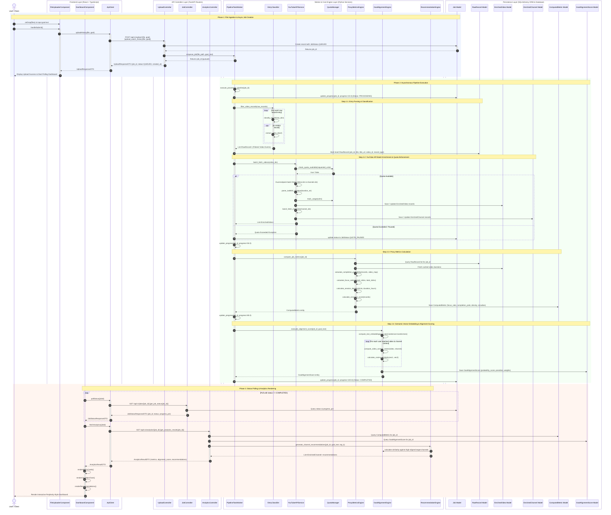

# YouTube Behavioral Analytics & Goal Alignment Predictor: Class Diagram Documentation

This folder contains the complete **Mermaid.js v11 Class Diagram** for the **YouTube Behavioral Analytics & Goal Alignment Predictor** system, designed according to the specifications in the project proposal, detailed implementation plan, and SRS documentation.

---

## 1. Class Diagram (Mermaid v11)

```mermaid
classDiagram
    direction TB

    %% ==========================================
    %% ENUMS & TYPES
    %% ==========================================
    class RecordType {
        <<enumeration>>
        VIDEO
        COMMUNITY_POST
        AD
        NON_VIEWING_ACTIVITY
        INACCESSIBLE_VIDEO
    }

    class JobStatus {
        <<enumeration>>
        QUEUED
        PROCESSING
        QUOTA_PAUSED
        COMPLETED
        FAILED
    }

    %% ==========================================
    %% PERSISTENCE LAYER (SQLAlchemy ORM Models)
    %% ==========================================
    class Job {
        <<orm_model>>
        +String id PK
        +JobStatus status
        +Integer total_records
        +Integer video_records
        +Integer community_post_records
        +Integer ad_records
        +Integer non_viewing_records
        +String goal_text
        +Float progress_pct
        +DateTime created_at
        +DateTime completed_at
    }

    class RawRecord {
        <<orm_model>>
        +Integer id PK
        +String job_id FK
        +DateTime timestamp
        +String raw_title
        +String title_url
        +String video_id
        +RecordType record_type
    }

    class EnrichedVideo {
        <<orm_model>>
        +String video_id PK
        +String channel_id FK
        +String video_title
        +String video_description
        +String tags_json
        +String category_id
        +Integer duration_seconds
        +String topic_categories_json
        +DateTime cached_at
    }

    class EnrichedChannel {
        <<orm_model>>
        +String channel_id PK
        +String channel_title
        +String channel_description
        +String topic_categories_json
        +DateTime cached_at
    }

    class ComputedMetric {
        <<orm_model>>
        +Integer id PK
        +String job_id FK
        +Float focus_ratio
        +Float median_completion_prob
        +Float session_density
        +Float circadian_score
        +String window_period
        +DateTime calculated_at
    }

    class GoalAlignmentScore {
        <<orm_model>>
        +Integer id PK
        +String job_id FK
        +Float alignment_probability_score
        +Float focus_ratio_weight
        +Float completion_weight
        +Float session_density_penalty
        +Float circadian_penalty
        +DateTime calculated_at
    }

    %% ORM Relationships
    Job "1" *-- "0..*" RawRecord : contains
    Job "1" *-- "0..1" ComputedMetric : produces
    Job "1" *-- "0..1" GoalAlignmentScore : scores
    EnrichedChannel "1" o-- "0..*" EnrichedVideo : owns

    %% ==========================================
    %% CORE SERVICE ENGINES (Python Services)
    %% ==========================================
    class EntryClassifier {
        <<service>>
        +classify_record(raw_dict: dict) RecordType
        +filter_video_records(raw_records: List~dict~) List~RawRecord~
        -extract_video_id(url: String) String
    }

    class QuotaManager {
        <<service>>
        +Integer MAX_DAILY_QUOTA = 10000
        -Integer cumulative_units
        -DateTime reset_at
        +track_usage(units: Integer) Boolean
        +check_quota_available(requested_units: Integer) Boolean
        +reset_daily_quota() Void
    }

    class YouTubeAPIService {
        <<service>>
        -String api_key
        -QuotaManager quota_manager
        +batch_fetch_videos(video_ids: List~String~) List~EnrichedVideo~
        +batch_fetch_channels(channel_ids: List~String~) List~EnrichedChannel~
        -parse_iso8601_duration(duration_str: String) Integer
    }

    class ProxyMetricsEngine {
        <<service>>
        +Float session_boundary_minutes = 30.0
        +Float high_density_threshold = 15.0
        +calculate_completion_probability(records: List~RawRecord~, video_map: Map) List~Float~
        +calculate_focus_ratio(aligned_clicks: Integer, total_clicks: Integer) Float
        +calculate_session_density(clicks: Integer, duration_hours: Float) Float
        +calculate_circadian_score(records: List~RawRecord~) Float
        +compute_job_metrics(job_id: String) ComputedMetric
    }

    class GoalAlignmentEngine {
        <<service>>
        +String model_name = "all-MiniLM-L6-v2"
        -Object embedding_model
        -Float weight_channel = 0.40
        -Float weight_topic = 0.35
        -Float weight_video = 0.25
        +compute_text_embedding(text: String) ndarray
        +compute_video_context_vector(video: EnrichedVideo, channel: EnrichedChannel) ndarray
        +calculate_cosine_similarity(vec1: ndarray, vec2: ndarray) Float
        +evaluate_alignment_score(job_id: String, goal_text: String) GoalAlignmentScore
    }

    class RecommendationEngine {
        <<service>>
        -GoalAlignmentEngine alignment_engine
        +generate_channel_recommendations(job_id: String, goal_text: String, top_k: Integer) List~EnrichedChannel~
    }

    %% Service Dependencies
    YouTubeAPIService --> QuotaManager : uses
    RecommendationEngine --> GoalAlignmentEngine : uses
    ProxyMetricsEngine ..> RawRecord : evaluates
    ProxyMetricsEngine ..> EnrichedVideo : references
    GoalAlignmentEngine ..> EnrichedVideo : embeds
    GoalAlignmentEngine ..> EnrichedChannel : embeds

    %% ==========================================
    %% WORKER & TASK QUEUE
    %% ==========================================
    class PipelineTaskWorker {
        <<background_worker>>
        -EntryClassifier classifier
        -YouTubeAPIService api_service
        -ProxyMetricsEngine proxy_engine
        -GoalAlignmentEngine alignment_engine
        +enqueue_job(file_path: String, goal_text: String) String
        +execute_processing_pipeline(job_id: String) Void
        -update_progress(job_id: String, progress: Float) Void
    }

    PipelineTaskWorker --> EntryClassifier : invokes
    PipelineTaskWorker --> YouTubeAPIService : invokes
    PipelineTaskWorker --> ProxyMetricsEngine : invokes
    PipelineTaskWorker --> GoalAlignmentEngine : invokes
    PipelineTaskWorker --> Job : updates

    %% ==========================================
    %% API CONTROLLERS & SCHEMAS (FastAPI)
    %% ==========================================
    class UploadController {
        <<api_router>>
        +upload_watch_history(file: UploadFile, goal: String) UploadResponseDTO
    }

    class JobController {
        <<api_router>>
        +get_job_status(job_id: String) JobStatusResponseDTO
    }

    class AnalyticsController {
        <<api_router>>
        +get_analytics_results(job_id: String) AnalyticsResultDTO
    }

    class UploadResponseDTO {
        <<pydantic_schema>>
        +String job_id
        +JobStatus status
        +String message
        +DateTime created_at
    }

    class JobStatusResponseDTO {
        <<pydantic_schema>>
        +String job_id
        +JobStatus status
        +Float progress_pct
        +Integer total_records
        +Integer video_records
    }

    class AnalyticsResultDTO {
        <<pydantic_schema>>
        +String job_id
        +ComputedMetric metrics
        +GoalAlignmentScore alignment_score
        +List~EnrichedChannel~ recommendations
    }

    UploadController ..> PipelineTaskWorker : dispatches
    UploadController ..> UploadResponseDTO : returns
    JobController ..> Job : queries
    JobController ..> JobStatusResponseDTO : returns
    AnalyticsController ..> ComputedMetric : queries
    AnalyticsController ..> GoalAlignmentScore : queries
    AnalyticsController ..> AnalyticsResultDTO : returns

    %% ==========================================
    %% FRONTEND CLIENT (React + TypeScript)
    %% ==========================================
    class ApiClient {
        <<frontend_service>>
        +uploadHistory(file: File, goal: String) Promise~UploadResponseDTO~
        +pollStatus(jobId: String) Promise~JobStatusResponseDTO~
        +fetchAnalytics(jobId: String) Promise~AnalyticsResultDTO~
    }

    class FileUploaderComponent {
        <<react_component>>
        -File selectedFile
        -String selectedGoal
        +onDrop(files: File[]) Void
        +handleSubmit() Void
    }

    class DashboardComponent {
        <<react_component>>
        -AnalyticsResultDTO analyticsData
        +renderMetricCards() JSX
        +renderCircadianChart() JSX
        +renderRecommendations() JSX
    }

    FileUploaderComponent --> ApiClient : uses
    DashboardComponent --> ApiClient : uses
```

---

## 2. Layer & Class Breakdown

### 2.1 Persistence Layer (SQLAlchemy Models)
- **`Job`**: Stores metadata for each uploaded ingestion job, tracking overall progress, record counts by category (`video_records`, `community_post_records`, `ad_records`, `non_viewing_records`), and job execution timestamps.
- **`RawRecord`**: Stores raw Google Takeout click events associated with a job ID, tagged with an isolated `RecordType`.
- **`EnrichedVideo`**: Stores video metadata cached from YouTube Data API v3 (`videos.list`), including category ID, ISO 8601 duration in seconds, tags, and Wikipedia `topicCategories`.
- **`EnrichedChannel`**: Stores channel metadata cached from `channels.list`, including channel title, channel description, and channel `topicCategories`.
- **`ComputedMetric`**: Stores mathematical behavioral proxy metrics calculated by `ProxyMetricsEngine` (Focus Ratio, Median Completion Probability, Session Density, Circadian Score).
- **`GoalAlignmentScore`**: Stores the output of `GoalAlignmentEngine`, including composite probability scores and penalty weights.

### 2.2 Core Service Engines (Python Business Logic)
- **`EntryClassifier`**: Classifies raw JSON entries into 5 distinct `RecordType` categories before timestamp-gap metrics are computed to prevent clustered Community Posts/Ads from injecting false near-zero gaps.
- **`QuotaManager`**: Thread-safe tracker ensuring API consumption stays under YouTube Data API's daily 10,000 unit limit.
- **`YouTubeAPIService`**: Implements 50-ID dual-endpoint batching (`videos.list` and `channels.list`) to maximize API efficiency up to 50x per unit.
- **`ProxyMetricsEngine`**: Derives behavioral engagement proxy metrics using click timestamps, video durations, and a 30-minute session boundary cutoff rule.
- **`GoalAlignmentEngine`**: Uses `sentence-transformers` (`all-MiniLM-L6-v2`) to perform unsupervised 384-dimensional vector embedding similarity calculations between user goal text and weighted video context (Channel 40%, Topic 35%, Title 25%).
- **`RecommendationEngine`**: Generates ranked channel replacement recommendations based on cosine similarity with the user's stated goal.

### 2.3 Background Worker & API Controllers
- **`PipelineTaskWorker`**: Background processing worker (Huey / Celery) coordinating the sequential workflow across classification, API batching, metric derivation, and goal scoring.
- **`UploadController`**, **`JobController`**, **`AnalyticsController`**: FastAPI REST routers managing upload ingestion (`202 Accepted`), status polling, and analytics rendering.

### 2.4 Frontend Interfaces
- **`ApiClient`**: Axios/TypeScript service facilitating REST communication between React frontend and FastAPI backend.
- **`FileUploaderComponent`** & **`DashboardComponent`**: High-end minimalist Perplexity-style UI components for user file input and interactive visualization.

---

## 3. Sequence Diagram (Mermaid v11)

---

## 4. State Machine Diagram (Mermaid v11)

```mermaid
stateDiagram-v2
    direction TB

    [*] --> Idle

    %% IDLE / FRONTEND INPUT STATE
    state Idle {
        [*] --> AwaitingInput
        AwaitingInput --> FileSelected : onDrop(files)
        FileSelected --> GoalSpecified : input goal_text
        GoalSpecified --> FormSubmitted : handleSubmit()
    }

    Idle --> QUEUED : ApiClient.uploadHistory() / UploadController.upload_watch_history()

    %% QUEUED STATE
    state QUEUED {
        [*] --> JobCreatedDB : Job model inserted (status=QUEUED)
        JobCreatedDB --> DispatchedToQueue : PipelineTaskWorker.enqueue_job()
        DispatchedToQueue --> WaitingForWorker : Pending worker pickup
    }

    QUEUED --> PROCESSING : PipelineTaskWorker.execute_processing_pipeline()

    %% PROCESSING COMPOSITE STATE
    state PROCESSING {
        direction TB
        
        [*] --> EntryParsingAndClassification

        %% Step 1: Parsing & Entry Classification
        state EntryParsingAndClassification {
            [*] --> ParsingRawJSON
            ParsingRawJSON --> ClassifyingRecordType : EntryClassifier.classify_record()
            ClassifyingRecordType --> FilteringVideoEvents : EntryClassifier.filter_video_records()
            FilteringVideoEvents --> ExtractingVideoIDs : EntryClassifier.extract_video_id()
            ExtractingVideoIDs --> PersistingRawRecords : Bulk Save RawRecord ORM
        }

        EntryParsingAndClassification --> APIEnrichmentAndQuota : Progress updated to 10%

        %% Step 2: YouTube API Batch Enrichment & Quota Management
        state APIEnrichmentAndQuota {
            [*] --> CheckingQuotaAvailability : QuotaManager.check_quota_available()
            CheckingQuotaAvailability --> BatchFetchingMetadata : Quota Available
            BatchFetchingMetadata --> FetchingVideoDetails : YouTubeAPIService.batch_fetch_videos()
            FetchingVideoDetails --> ParsingDurations : YouTubeAPIService.parse_iso8601_duration()
            ParsingDurations --> FetchingChannelDetails : YouTubeAPIService.batch_fetch_channels()
            FetchingChannelDetails --> TrackingQuotaUsage : QuotaManager.track_usage()
            TrackingQuotaUsage --> PersistingEnrichedData : Save EnrichedVideo & EnrichedChannel
        }

        APIEnrichmentAndQuota --> ProxyMetricsCalculation : Progress updated to 50%

        %% Step 3: Behavioral Proxy Metrics Derivation
        state ProxyMetricsCalculation {
            [*] --> FetchingRecordsAndDurations : Query RawRecord & EnrichedVideo
            FetchingRecordsAndDurations --> CalculatingCompletionProb : ProxyMetricsEngine.calculate_completion_probability()
            CalculatingCompletionProb --> CalculatingFocusRatio : ProxyMetricsEngine.calculate_focus_ratio()
            CalculatingFocusRatio --> CalculatingSessionDensity : ProxyMetricsEngine.calculate_session_density()
            CalculatingSessionDensity --> CalculatingCircadianScore : ProxyMetricsEngine.calculate_circadian_score()
            CalculatingCircadianScore --> PersistingComputedMetrics : Save ComputedMetric ORM
        }

        ProxyMetricsCalculation --> GoalAlignmentScoring : Progress updated to 85%

        %% Step 4: Semantic Embedding & Goal Alignment
        state GoalAlignmentScoring {
            [*] --> EmbeddingUserGoal : GoalAlignmentEngine.compute_text_embedding()
            EmbeddingUserGoal --> EmbeddingVideoContext : GoalAlignmentEngine.compute_video_context_vector()
            EmbeddingVideoContext --> CosineSimilarityCalculation : GoalAlignmentEngine.calculate_cosine_similarity()
            CosineSimilarityCalculation --> PersistingAlignmentScore : Save GoalAlignmentScore ORM
        }

        GoalAlignmentScoring --> PipelineExecutionComplete
    }

    %% QUOTA PAUSED STATE
    PROCESSING --> QUOTA_PAUSED : YouTube API Quota Exceeded (10k units/day)
    state QUOTA_PAUSED {
        [*] --> QuotaLimitReached
        QuotaLimitReached --> WaitingForDailyReset : Sleep until reset_at timestamp
        WaitingForDailyReset --> ResettingQuota : QuotaManager.reset_daily_quota()
    }
    QUOTA_PAUSED --> PROCESSING : Quota Reset Complete / Resume Pipeline

    %% FAILURE STATE
    PROCESSING --> FAILED : Exception / Invalid File / Processing Error
    state FAILED {
        [*] --> ErrorLogged
        ErrorLogged --> JobStatusFailed : Job model status updated to FAILED
    }

    %% COMPLETED COMPOSITE STATE
    PROCESSING --> COMPLETED : Progress updated to 100% (JobStatus.COMPLETED)
    
    state COMPLETED {
        [*] --> PollingSuccessReceived : DashboardComponent detects COMPLETED via ApiClient.pollStatus()
        PollingSuccessReceived --> FetchingAnalyticsData : ApiClient.fetchAnalytics() / AnalyticsController.get_analytics_results()
        FetchingAnalyticsData --> GeneratingRecommendations : RecommendationEngine.generate_channel_recommendations()
        GeneratingRecommendations --> DashboardRendering : DashboardComponent active
        
        state DashboardRendering {
            [*] --> RenderingMetrics : DashboardComponent.renderMetricCards()
            RenderingMetrics --> RenderingCircadian : DashboardComponent.renderCircadianChart()
            RenderingCircadian --> RenderingRecommendations : DashboardComponent.renderRecommendations()
        }
    }

    COMPLETED --> [*]
    FAILED --> [*]
```

