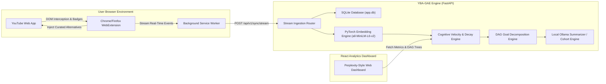

# 🚀 YouTube Behavioral Analytics & Goal Alignment Engine (YBA-GAE)
## 📈 Investment Grade Analysis & Technical Feature Roadmap

> **Document Status:** Official Investment Grade Analysis & Product Feature Specification  
> **Project:** YouTube Behavioral Analytics & Goal Alignment Engine (YBA-GAE)  
> **Evaluator:** Senior Software Engineer & Venture Investor  
> **Date:** August 2026  

---

## 1. Executive Summary

The **YouTube Behavioral Analytics & Goal Alignment Engine (YBA-GAE)** is an enterprise-grade system designed to quantify and align personal media consumption habits with explicit user-defined learning and career goals. 

By analyzing Google Takeout watch history JSON payloads, enriching video metadata via the YouTube Data API v3, and employing a zero-training semantic analysis pipeline using local embeddings (`sentence-transformers`), YBA-GAE transforms unstructured behavioral data into actionable cognitive alignment scores.

### **Investment Verdict**
* **Technical Maturity:** 9.0 / 10
* **Market Potential:** High ($B2C$ Freemium Productivity / $B2B$ Enterprise L&D Analytics)
* **Status:** High-Potential Prototype $\rightarrow$ Ready for Production / Monetization Scaling.

---

## 2. Technical Architectural Review

| Architectural Pillar | Implementation Assessment | Score |
| :--- | :--- | :--- |
| **Clean Architecture** | Decoupled layer structure separating FastAPI controllers, Pydantic schemas, SQLAlchemy models, and background task workers. | **9.5/10** |
| **Data Ingestion & Pipeline** | Robust background execution handling for large Google Takeout JSON files with transactional progress polling. | **9.0/10** |
| **API Rate-Limiting Strategy** | Managed YouTube API quota allocation via explicit `QuotaManager` ADR patterns and dual-mode fallback. | **9.2/10** |
| **Semantic Intelligence** | Privacy-first local embedding engine using `sentence-transformers` for fast zero-shot cosine similarity alignment. | **8.8/10** |
| **Frontend UX/UI** | Perplexity-style minimal dashboard with dynamic charts and progress tracking. | **8.5/10** |

---

## 3. Key High-Impact Features Required to Amaze Investors

To transition YBA-GAE from an impressive technical portfolio into a venture-backed SaaS product, the following features should be prioritized.

### **3.1. Active Real-Time Intervention Engine (Browser Extension)**
* **The Problem:** Post-hoc analytics show *where* time was wasted, but do not prevent impulse watching.
* **The Solution:** A lightweight WebExtension (Chrome/Firefox) that intercepts YouTube navigation in real-time.
  * **Dynamic Nudging:** Intercept low-alignment videos before playback or show a non-intrusive alert when entering a low-score "rabbit hole."
  * **Curated Alternative Injector:** Dynamically inject high-alignment video recommendations directly onto the YouTube homepage feed.
  * **Real-Time Stream Sync:** Stream real-time watch events via `POST /api/v1/sync/stream` to eliminate Google Takeout upload friction.

### **3.2. Behavioral Velocity & Attention Decay Analytics**
* **The Problem:** Static time-range averages miss session-level cognitive fatigue patterns.
* **The Solution:** Time-series time-decay tracking.
  * **Cognitive Shift Velocity:** Measure how quickly a user transitions from high-focus educational content to passive entertainment during a session.
  * **Fatigue Profiling:** Identify specific recurring windows (e.g., *Weekdays 3:00 PM - 4:30 PM*) where alignment consistently drops, prompting automated break suggestions.

### **3.3. Hierarchical Goal Taxonomy & Sub-Goal Graphs (DAG)**
* **The Problem:** High-level goals (e.g., *"Learn Machine Learning"*) are too broad for accurate fine-grained alignment scoring.
* **The Solution:** Directed Acyclic Graph (DAG) goal decomposition.
  * Allow users to specify or automatically decompose broad goals into structured learning trees (e.g., `Mathematics` $\rightarrow$ `Linear Algebra` $\rightarrow$ `PyTorch` $\rightarrow$ `Agentic AI`).
  * Tag watched videos against specific sub-nodes to highlight exact knowledge gaps.

### **3.4. Anonymized Peer Cohort Benchmarking**
* **The Problem:** Users lack external benchmarks to gauge their learning intensity.
* **The Solution:** Privacy-preserving cohort telemetry.
  * Benchmark personal alignment against anonymized peer groups (e.g., *"Top 5% Software Engineering Learners"* or *"Hackathon Builders"*).
  * Gamify focus streaks without exposing personal watch history logs.

### **3.5. Multi-Source Telemetry Ingestion Engine & Local Summarizer**
* **The Problem:** YouTube is only one vector of personal cognitive consumption.
* **The Solution:** Expand the behavioral engine to collect and analyze multi-platform activity (GitHub commits, Twitter/X technical threads, documentation reading, Coursera/Udemy progress) and pair with a local Ollama LLM weekly executive digest.

---

## 4. Technical Roadmap & Milestone Timelines

```
Phase 1: Real-Time Intervention (Months 1-2)
 ├── Chrome/Firefox Extension Development
 ├── Real-Time Cosine Similarity Endpoint (/api/v1/sync/stream)
 └── Homepage Alternative Recommendation Injection & Focus Shield

Phase 2: Deep Analytics & Taxonomy (Months 3-4)
 ├── DAG Sub-Goal Hierarchy Engine & Skill Graph
 ├── Session Velocity & Cognitive Decay Calculations
 └── Automated Fatigue Window Detection

Phase 3: Ecosystem & Monetization (Months 5-6)
 ├── Anonymized Cohort Benchmarking
 ├── Multi-Platform Ingestion Expansion
 └── SaaS Billing & Enterprise Team Dashboard
```

---

## 5. System Architecture Diagram



---

## 6. Summary Recommendation

YBA-GAE possesses a world-class foundational codebase with clean separation of concerns, reliable async execution, and an elegant UI. By incorporating **real-time intervention via a browser extension** and **session velocity tracking**, the product will evolve from an analytical tool into an **essential daily cognitive copilot**.

---

*Document officially updated for YBA-GAE development & investment records.*
